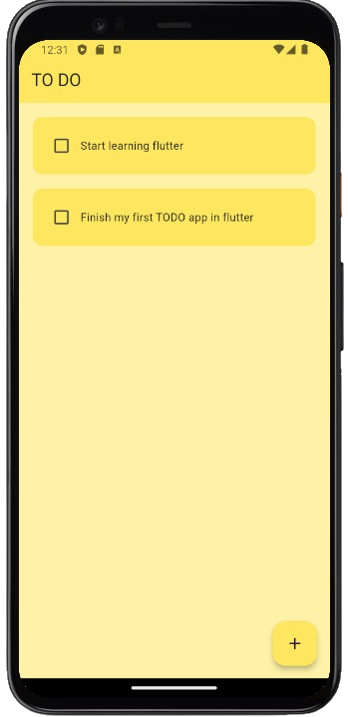
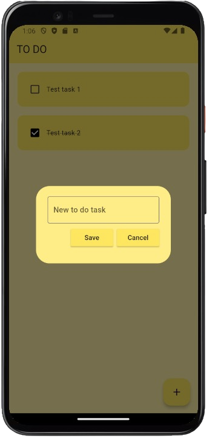

# TODO APP

This Flutter project is a simple ToDo app that allows users to manage their tasks. Users can create new tasks, mark tasks as completed or incomplete, and delete tasks.

## Features
- **Create new task** - Add new tasks.
- **Update a task** - Mark tasks as completed or incomplete.
- **Delete a task** - Remove tasks when they are no longer needed.
- **Data persistence** - Uses Hive for local data storage, ensuring tasks are saved even when the app is closed.

## App Screenshots

## Technologies used
- **Flutter**: Framework for building cross-platform mobile applications.
- **Hive**: Lightweight and fast NoSQL database for local data storage.

## Getting Started

- Clone the repository `git clone https://github.com/denniskimtai/FlutterToDoApp.git`
- Navigate into the project directory `cd FlutterToDoApp`
- Install dependencies `flutter pub get`
- Run the app `flutter run`
